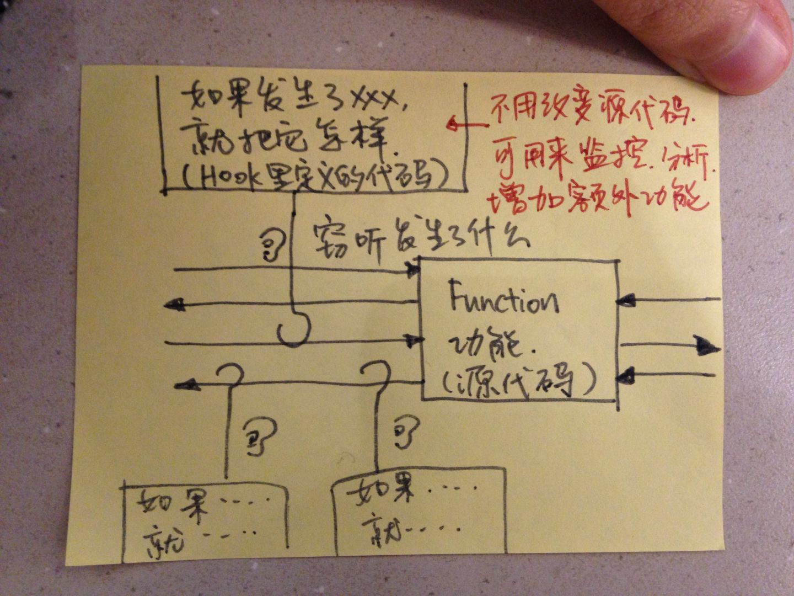

# Hook 

## A: What it is?

Hook means a technology to expand functions in application, that means the program can excute the specific code when hook function invoked.

## B: What problem should be solved?

Function expand without modify code.

## C: How-To and why?

The essence of hook technology is to hijack function calls.

### Basic Conception

N/A.

## D: Examples validation

N/A.

## E: Application?

- Prevent repeated execution of procedures
- Resource release

## F: Epilog

Hook technology can be implemented in different programming languages, it's convient to expand functions.

## G: Reference

- [https://www.exception.site/java-concurrency/java-concurrency-hook-thread](https://www.exception.site/java-concurrency/java-concurrency-hook-thread)
- [https://segmentfault.com/a/1190000039752789](https://segmentfault.com/a/1190000039752789)
